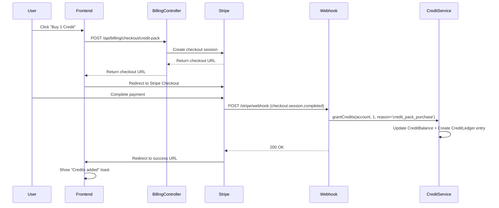
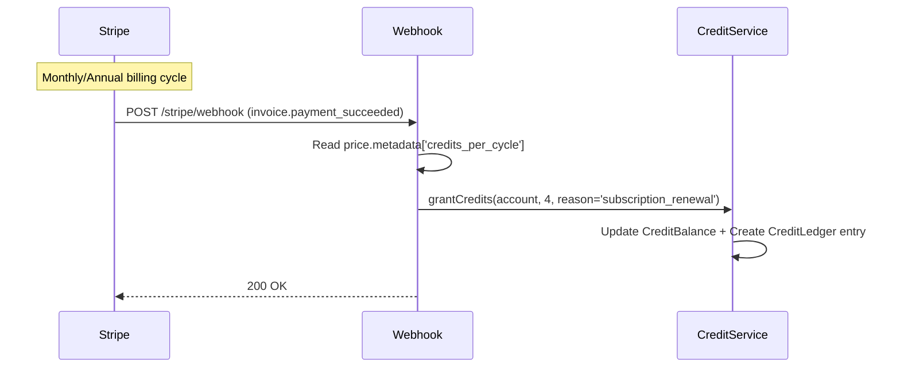
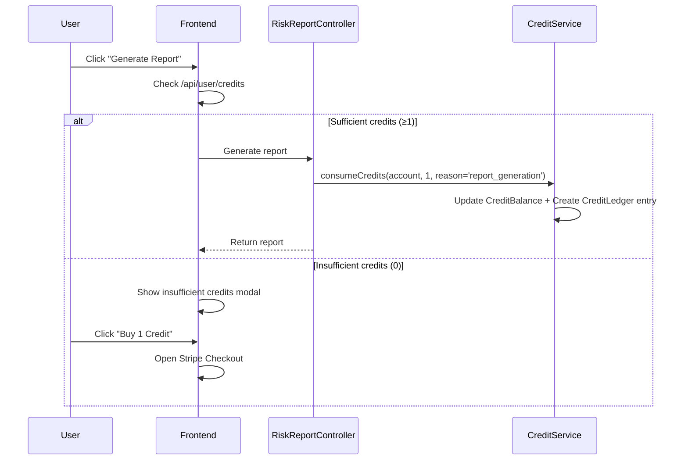

# Billing System Documentation

This document provides a complete guide to setting up and configuring the Vinlytic billing system with Stripe integration.

## Quick Setup (10 minutes)

### 1. Environment Variables

Add these environment variables to your `.env` file:

```env
# Stripe Configuration
STRIPE_SECRET=sk_test_...                    # Your Stripe secret key
STRIPE_WEBHOOK_SECRET=whsec_...              # Webhook endpoint secret
STRIPE_FAMILY_ANNUAL_PRICE_ID=price_...      # Family Annual subscription price ID
STRIPE_CREDIT_PACK_PRICE_ID_1=price_...      # 1 credit pack price ID
STRIPE_CREDIT_PACK_PRICE_ID_3=price_...      # 3 credit pack price ID
STRIPE_CREDIT_PACK_PRICE_ID_5=price_...      # 5 credit pack price ID
STRIPE_FAMILY_CREDITS_PER_CYCLE=4            # Credits granted per subscription cycle
STRIPE_SUCCESS_URL=https://yourapp.com/billing/success?session_id={CHECKOUT_SESSION_ID}
STRIPE_CANCEL_URL=https://yourapp.com/billing/cancelled
```

### 2. Create Stripe Prices

#### Family Annual Subscription
1. Go to Stripe Dashboard → Products → Create Product
2. Name: "Family Annual"
3. Description: "Annual subscription with 4 credits per cycle"
4. Pricing: £99.00/year (recurring)
5. **Important**: Add metadata `credits_per_cycle=4`
6. Copy the Price ID to `STRIPE_FAMILY_ANNUAL_PRICE_ID`

#### Credit Packs
Create three one-time payment products:

**1 Credit Pack:**
- Name: "1 Credit"
- Price: £5.00 (one-time)
- Metadata: `credits=1`

**3 Credit Pack:**
- Name: "3 Credits" 
- Price: £12.00 (one-time)
- Metadata: `credits=3`

**5 Credit Pack:**
- Name: "5 Credits"
- Price: £18.00 (one-time) 
- Metadata: `credits=5`

### 3. Webhook Setup

1. Go to Stripe Dashboard → Developers → Webhooks
2. Add endpoint: `https://yourapp.com/stripe/webhook`
3. Select events:
   - `checkout.session.completed`
   - `invoice.payment_succeeded`
   - `customer.subscription.deleted`
4. Copy the webhook secret to `STRIPE_WEBHOOK_SECRET`

## System Architecture

### Models

- **Account**: User account with `stripe_customer_id`
- **CreditBalance**: Current credit balance per account
- **CreditLedger**: Transaction history with reasons and metadata
- **StripeEvent**: Webhook event tracking for idempotency

### Services

- **CreditService**: Handles credit grants/consumption with atomic transactions
- **StripeClientFactory**: Creates configured Stripe client instances
- **BillingController**: Creates checkout sessions for subscriptions and credit packs

## Event Flow Diagrams

### Credit Pack Purchase Flow



### Subscription Renewal Flow



### Report Generation Flow



## API Endpoints

### User Credits
- **GET** `/api/user/credits` - Get current credit balance
- **Response**: `{"balance": 5, "user_id": 123}`

### Billing Checkout
- **POST** `/api/billing/checkout/family-annual` - Create family subscription checkout
- **POST** `/api/billing/checkout/credit-pack` - Create credit pack checkout
  - **Body**: `{"pack": "1"|"3"|"5"}`
- **Response**: `{"url": "https://checkout.stripe.com/..."}`

### Admin Credit Management
- **GET** `/api/admin/accounts/{account}/credits` - Get account credit details
- **POST** `/api/admin/accounts/{account}/credits/adjust` - Adjust credits
  - **Body**: `{"delta": 5, "reason": "manual_adjustment"}`

## Webhook Event Handling

### checkout.session.completed
- **Credit Packs**: Grants credits immediately based on session metadata
- **Subscriptions**: Links customer ID, waits for invoice payment

### invoice.payment_succeeded  
- **Subscriptions**: Grants credits based on `price.metadata['credits_per_cycle']`
- **Fallback**: Uses `STRIPE_FAMILY_CREDITS_PER_CYCLE` if metadata missing

### customer.subscription.deleted
- **Action**: Logs cancellation, no credit changes

## Credit Coupon System

The system supports credit-based coupons that grant credits directly without payment processing:

### **Local Implementation (Recommended)**
- ✅ **Instant credit grants** - no payment processing needed
- ✅ **Better user experience** - immediate gratification
- ✅ **No Stripe fees** for promotional credits
- ✅ **Full control** over validation and business logic

### **Creating Credit Coupons**
1. Go to Admin → Coupons → Create New Coupon
2. Set Discount Type to "Credits"
3. Enter number of credits to grant
4. Set usage limits and validity period
5. Save coupon

### **Redeeming Credit Coupons**
- Users can redeem coupons on the Billing page
- Instant credit grants with full audit trail
- Validation includes expiry, usage limits, and user limits

### **API Endpoints**
- **POST** `/api/credit-coupons/redeem` - Redeem a credit coupon
- **POST** `/api/credit-coupons/validate` - Validate coupon without redeeming
- **GET** `/api/credit-coupons/available` - Get available coupons for user

## Refund Policy

Refunds are handled manually through admin interface:

1. Admin creates compensating ledger entry with `reason='refund'`
2. Negative delta reduces credit balance
3. Full audit trail maintained in CreditLedger

**Example refund entry:**
```php
CreditLedger::create([
    'account_id' => $account->id,
    'delta' => -5,  // Negative for refund
    'reason' => 'refund',
    'created_by' => $admin->id,
    'occurred_at' => now(),
]);
```

## Security Features

- **Webhook Signature Verification**: All webhooks verified using Stripe signatures
- **Idempotency**: Duplicate events prevented via StripeEvent tracking
- **Atomic Transactions**: Credit operations use database transactions
- **Authentication**: All endpoints require Sanctum authentication
- **Admin Authorization**: Credit adjustments require admin middleware

## Error Handling

- **Invalid Signatures**: Returns 400 with error details
- **Missing Configuration**: Returns 500 with helpful error messages  
- **Stripe API Errors**: Logged and returned as 500 responses
- **Insufficient Credits**: Throws `InsufficientCreditsException`

## Monitoring & Logging

All webhook events and credit operations are logged with:
- Event ID and type
- Processing status
- Error details (if any)
- Credit grant/consumption details
- User and account information

## Testing

### Unit Tests
- `CreditServiceTest` - Credit operations and edge cases
- `StripeWebhookTest` - Webhook event processing
- `BillingControllerTest` - Checkout session creation

### Manual Testing
1. Create test Stripe products with metadata
2. Use Stripe test cards for payment simulation
3. Verify webhook events in Stripe Dashboard
4. Check credit balances and ledger entries

## Troubleshooting

### Common Issues

**Credits not granted after payment:**
- Check webhook endpoint is accessible
- Verify webhook secret matches environment variable
- Check Stripe Dashboard for failed webhook deliveries
- Review application logs for processing errors

**Checkout sessions failing:**
- Verify all price IDs are correct in environment
- Check Stripe secret key has proper permissions
- Ensure success/cancel URLs are accessible

**Duplicate credit grants:**
- Check StripeEvent model for duplicate event IDs
- Verify webhook idempotency is working
- Review CreditLedger for duplicate entries

### Debug Commands

```bash
# Check credit balance for user
php artisan tinker
>>> $user = User::find(1);
>>> $user->creditBalance;

# View recent ledger entries
>>> $user->creditLedger()->latest()->limit(10)->get();

# Check webhook events
>>> StripeEvent::latest()->limit(10)->get();
```

## Production Checklist

- [ ] All environment variables configured
- [ ] Stripe products created with correct metadata
- [ ] Webhook endpoint configured and tested
- [ ] SSL certificate installed for webhook endpoint
- [ ] Error monitoring configured (Sentry, etc.)
- [ ] Database backups configured
- [ ] Rate limiting configured for API endpoints
- [ ] Admin users have proper permissions
- [ ] Test payments with real Stripe account
- [ ] Monitor webhook delivery success rates
