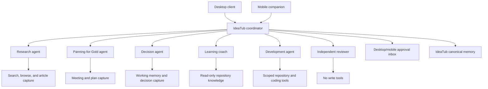

# Alice and Desktop AI Agent Alternatives

**Date:** 13 August 2026  
**Purpose:** Evaluate Alice and the strongest alternatives for a desktop-first, mobile-accessible AI workspace containing specialised agents with different models, tools, knowledge, permissions, and handoff capabilities.

## Executive summary

The ideal product is not simply an AI agent builder. It is a personal AI workspace with:

- A polished desktop client
- A usable mobile companion
- Named specialist agents
- Different models, instructions, knowledge, and tools for each agent
- Controlled agent-to-agent delegation
- MCP access to IdeaTub and other systems
- Shared but governed memory
- Approvals before consequential actions
- Local-first or self-hosted storage where practical

On that basis, the five strongest alternatives are:

1. **Msty Studio + Msty Go** — closest ready-made Alice-style experience
2. **LibreChat** — strongest self-hosted multi-agent system
3. **TypingMind** — best polished cross-device conversational workspace
4. **AnythingLLM** — best local-first desktop and Android combination
5. **Open WebUI** — best extensible, self-hosted personal AI portal

## Executive comparison

Scores are relative to the requirements above, rather than measures of general product quality. A score of 5 represents the strongest fit.

| Capability | Alice | Msty | LibreChat | TypingMind | AnythingLLM | Open WebUI |
|---|---:|---:|---:|---:|---:|---:|
| Desktop experience | 5 | 5 | 3 | 4 | 5 | 4 |
| Mobile companion | 1 | 3\* | 3 | 4 | 4\*\* | 4 |
| Per-agent models | 5 | 5 | 5 | 5 | 3 | 5 |
| Per-agent tools | 5 | 5 | 5 | 5 | 4 | 5 |
| True agent delegation | 5 | 4 | 5 | 3 | 2 | 2 |
| MCP support | 5 | 5 | 5 | 4 | 4 | 4 |
| Knowledge/RAG | 4 | 5 | 5 | 4 | 5 | 5 |
| Local/self-hosted | 5 | 5 | 5 | 2 | 5 | 5 |
| Cross-device continuity | 1 | 3\* | 5 | 5 | 4\*\* | 5 |
| Coding workflows | 4 | 5 | 4 | 2 | 3 | 5 |
| Setup simplicity | 5 | 4 | 2 | 5 | 4 | 2 |
| Fit for the current workflows | 4 | **5** | **5** | 4 | 4 | 4 |

\* Msty Go's native iOS and Android companion is described as coming soon or available through a limited beta.

\*\* AnythingLLM Mobile is clearly advertised for Android; an equivalent official iOS release was not identified during this research.

## Alice: the benchmark

### What Alice is

Alice is a local-first, cross-platform desktop AI workspace for macOS, Windows, and Linux. It combines the ease of a normal chat application with assistant profiles, reusable skills, model switching, documents, memory, tool use, and multi-agent collaboration.

Alice is not merely a collection of saved prompts. Since version 5, it includes inline and threaded multi-agent modes in which the active agent can call other agents or start new agent threads. See the [Alice installation and feature overview](https://heyalice.app/academy/installation-first-steps) and [Alice changelog](https://heyalice.app/changelog).

### Key features

#### Custom assistants

Each assistant can have:

- Its own name, avatar, and description
- A persistent system instruction
- A default model
- Dedicated skills
- Selected MCP servers and tools
- Separate memories
- Its own communication style and domain expertise

Assistants can be selected with keyboard shortcuts or mentioned with `@`. Alice also offers a library containing more than 50 assistants and 200 skills. See [Alice assistants](https://heyalice.app/academy/assistants).

#### Multi-agent operation

Alice 5 added:

- **Inline multi-agent mode:** the active agent calls another agent inside the current conversation
- **Threaded multi-agent mode:** the active agent creates a separate thread for another agent
- Direct `@` invocation of assistants
- Concurrent background conversations

This supports actual delegation rather than merely switching personas. See the [Alice changelog](https://heyalice.app/changelog).

#### Models

Alice supports OpenAI, Anthropic, Gemini, xAI, Groq, OpenRouter, Ollama, and OpenAI-compatible backends. Users can:

- Use Alice-provided model credits
- Bring individual provider API keys
- Run local models
- Connect a custom OpenAI-compatible backend

Keys are encrypted and stored locally. See [Alice API-key setup](https://heyalice.app/academy/setup-api-keys).

#### Skills and automations

An Alice Skill may be:

- A reusable prompt or procedure
- A remote action connected to a webhook
- A voice-triggered action
- A structured-output transformation
- An OS-wide keyboard shortcut

Skills can be used outside Alice through global hotkeys. This makes Alice partly comparable to Raycast or Keyboard Maestro rather than only ChatGPT. See [Alice skills](https://heyalice.app/academy/skills).

#### MCP and external tools

Alice supports MCP tools, resources, prompts, and sampling. MCP servers can be assigned to particular assistants, and individual tool availability can be constrained.

For example, an IdeaTub research agent could receive read, search, and capture tools, while a writing agent might receive only search and capture access rather than development or destructive operations. See [Alice MCP documentation](https://heyalice.app/academy/mcp).

Alice also supports:

- n8n through MCP
- Zapier and Make
- Webhook-based Remote Actions
- Custom backend applications
- Local and remote MCP servers

#### Knowledge and memory

Alice handles:

- Temporary file attachments
- Reusable document collections
- Web search
- Agent-specific memories
- Hybrid vector and full-text memory search
- Memory approval and editing

Memories are kept in a local SQLite database and associated with the active assistant. The documented implementation requires an OpenAI API key for embeddings. See [Alice memory](https://heyalice.app/academy/memory).

#### Additional capabilities

- Voice input and output
- Dictation to clipboard
- Images and image editing
- Artifacts and interactive UI generation
- Code interpreter
- Web browsing and cited online research
- Claude Code integration through ACP
- Deep links for Shortcuts and Keyboard Maestro
- Detailed tool-call confirmations and logging

### Advantages

- Probably the clearest expression of the “AI colleagues on my desktop” concept.
- True multi-agent calls are built into the chat interface.
- Excellent per-agent model, tool, skill, and memory configuration.
- Strong OS-level interaction through shortcuts and voice.
- Local conversation storage.
- Supports managed model access and bring-your-own-key usage.
- Broad MCP compatibility.
- Easy enough for everyday use without giving up technical depth.

### Disadvantages

- The UK payment restriction confirmed by the company is presently decisive.
- It has no proper mobile companion.
- Data does not automatically sync between devices; Alice documents a manual configuration-folder transfer process.
- The desktop must be available for local files and local MCP servers.
- Some features depend on separate provider keys even when the main application is licensed.
- Powerful MCP servers require careful permission scoping.
- A comparatively small product and company may present greater continuity risk.
- The Windows build is documented as not code-signed.
- Packaged model credits include fair-use limits and potentially variable economics. See [Alice pricing](https://heyalice.app/pricing).

### Application to the current workflows

Alice could be configured around IdeaTub as:

- **Idea curator:** searches recent IdeaTub thoughts and retrieves working memory.
- **Researcher:** browses sources and produces evidence-backed research.
- **Research-to-decision coordinator:** calls competitive-analysis, synthesis, and meeting agents.
- **Panning agent:** processes meetings and brain dumps into inventories and gold-found outputs.
- **Document librarian:** invokes `capture_plan`, `capture_meeting`, `capture_article`, and `capture_thought`.
- **Learning coach:** reads repository learning material and creates quizzes or learning notes.
- **Developer:** connects to Claude Code or a coding backend.
- **Reviewer:** receives no write tools and independently critiques plans or code.

The local desktop approach is particularly suitable for repository work and Markdown processing. The absence of mobile sync is a major weakness for capturing ideas, approving ongoing work, and continuing research away from the desktop.

## Alternative 1: Msty Studio + Msty Go

### Why it ranks first

Msty comes closest to reproducing Alice as a complete product rather than requiring the user to assemble a platform.

Msty Studio handles conversation, personas, models, knowledge, and MCP. Msty Go handles more autonomous work, scoped agents, execution boundaries, and mobile direction.

### Key features

#### Msty Studio

- Native desktop application
- Cloud and local models
- Assistant Personas
- User Personas and reusable personal memory
- Per-persona model, tools, knowledge, and attachments
- Crew conversations with multiple personas
- Configurable response order
- Contextual or independent crew members
- `@mention` coordination and handoffs
- MCP Toolbox
- Knowledge Stacks
- Web and live data
- Prompt, Persona, and Skills studios
- Agent Mode using Codex, Claude Code, or Gemini CLI
- Plan, approval, diff, and commit views

Msty's Persona Studio supports versioning and sandbox testing, which is helpful for maintaining specialist-agent definitions deliberately. See [Msty Persona Studio](https://docs.msty.ai/studio/studios/persona-studio).

#### Msty Go

- Role-based autonomous agents
- Folder-scoped access
- Local, Docker, or Podman execution
- Mission Control for coordinated helpers
- Visible approvals
- Memory Bank
- Reusable playbooks
- Scheduled tasks and shortcuts
- MCP tools
- Discord, Telegram, and WhatsApp channels
- Encrypted mobile direction
- Local and cloud models

See [Msty Go](https://msty.ai/products/go/).

### Advantages

- Closest match to Alice's desktop-first product philosophy.
- Stronger built-in knowledge management than Alice.
- Excellent local-model support.
- Per-persona tools, knowledge, and model settings.
- Crew conversations are approachable and visible.
- Coding integration maps directly onto repository work.
- The free Studio tier is substantial.
- Go is free while in beta.
- Strong privacy posture, with conversations stored locally.
- Container and folder boundaries are appropriate for agents with file access.

### Disadvantages

- The product range is fragmented: Studio and Go solve related but different problems.
- Crew Mode is partly structured group chat rather than always fully autonomous delegation.
- Some Crew features are restricted compared with normal chats.
- Studio data does not automatically sync across devices.
- Studio Web stores data separately in browser storage.
- The native Go mobile application is not yet a generally available, mature product.
- The combination of Studio, Go, Nexus, and future products makes the roadmap harder to evaluate.
- Some of the most attractive claims are attached to a beta product.
- Studio's Agent Mode is presently focused on coding-agent adapters rather than being a universal business-agent runtime.

### Application to the current workflows

Suggested setup:

#### IdeaTub Librarian Persona

- IdeaTub MCP only
- Search, working-memory, and capture operations
- No terminal access

#### Research Crew

- Market researcher using a strong web-enabled model
- Evidence critic using a different model
- Decision synthesiser
- Ordered, contextual responses

#### Panning Persona

- Panning for Gold prompts and reference files
- IdeaTub capture tools
- File access restricted to brainstorming folders

#### Learning Coach

- Knowledge Stack built from repository learning content
- No repository-write permissions

#### Development Agent

- Msty Agent Mode connected to Codex or Claude Code
- Workspace restricted to the IdeaTub repository
- Plan and diff approval enabled

#### Mobile operator

- Msty Go or Telegram until the native companion is generally available
- Check runs, approve actions, and capture new ideas

The principal reservation is the possibility of conversation occurring in Studio and autonomous execution occurring in Go without a completely unified history.

## Alternative 2: LibreChat

### Why it ranks second

LibreChat is the strongest option when true agent delegation, MCP permissions, and IdeaTub integration matter more than having a packaged native desktop application.

Its subagent implementation closely matches the desired architecture.

### Key features

- Self-hosted, open-source web application
- Broad multi-provider model support
- No-code Agent Builder
- Per-agent model and parameters
- Granular MCP tool selection
- File context and RAG
- Sandboxed code interpreter
- Web search
- Memory
- Reusable `SKILL.md` capabilities
- Agent Chains
- Runtime Subagents
- Artifacts
- Per-agent access-control lists
- Agents API
- Multi-user authentication and SSO

LibreChat distinguishes between:

- **Agent Chains:** configured multi-agent graphs
- **Subagents:** a parent agent dynamically delegates a focused task to an isolated child run

The child receives its own context and tools, then returns a compact result. This prevents verbose research or file operations from consuming the coordinator's context. See [LibreChat agents](https://www.librechat.ai/docs/features/agents) and [LibreChat subagents](https://www.librechat.ai/en/docs/features/subagents).

### Advantages

- Best true multi-agent architecture in this shortlist.
- Agents can use different providers and models.
- Exact MCP tools can be allowed or denied per agent.
- Subagents preserve tool, upload, and user context while remaining isolated.
- Skills can package instructions, references, scripts, assets, and permissions.
- Self-hosting removes regional SaaS-payment dependency.
- A single server gives desktop and mobile access to the same agents, memory, and conversations.
- Excellent match for IdeaTub's existing MCP API.
- The Agents API lets IdeaTub call the same configured agents.
- Strong access controls if agents are later exposed to other IdeaTub users.
- Better foundation than Msty if a custom native mobile client is eventually required.

### Disadvantages

- Not a native desktop app; it is a self-hosted web application.
- Setup requires Docker, configuration files, a database, and maintenance.
- Mobile is primarily responsive web/PWA rather than an official polished native companion.
- Community native mobile clients require independent security review.
- Code Interpreter is an additional service to deploy.
- Configuration is substantially more technical than Alice or Msty.
- The newest subagent and skill capabilities are relatively recent.
- The operator is responsible for backups, updates, security, and remote access.
- Local STDIO MCP tools are simpler on a local deployment than on a remotely hosted instance.

### Application to the current workflows

LibreChat is arguably the best architectural fit for IdeaTub:

```text
IdeaTub Coordinator
├── Research agent
│   ├── web search
│   ├── capture_article
│   └── research-only IdeaTub tools
├── Panning agent
│   ├── meeting/brain-dump skills
│   └── capture_plan / capture_meeting
├── Decision agent
│   ├── search_thoughts
│   ├── get_working_memory
│   └── capture_plan
├── Learning coach
│   └── read-only repository and learning tools
└── Development agent
    ├── repository tools
    └── no production credentials
```

The existing `SKILL.md`-based Research-to-Decision and Panning for Gold material maps naturally onto LibreChat Skills. Its subagent model also resembles the multi-agent workflows already used through Codex.

On mobile, the same hosted instance would expose the same coordinator, conversations, and approval state. This is more coherent than synchronising two local desktop databases.

## Alternative 3: TypingMind

### Why it ranks third

TypingMind is the best choice when an attractive, low-friction chat experience on desktop and mobile is required immediately and less sophisticated delegation is acceptable.

### Key features

- Browser application and installable PWA
- macOS wrapper/application
- Mobile-friendly interface
- Optional cross-device cloud sync
- Multiple model providers and custom endpoints
- Custom AI Agents
- Per-agent model, instructions, and parameters
- Per-agent plugins and knowledge
- MCP integration
- Prompt library
- Knowledge base/RAG
- Projects and folders
- Agent mentions
- Prompt chaining through Flows
- Multi-model comparison
- Voice input and text-to-speech
- Artifacts/Interactive Canvas
- Local storage by default
- One-time licence options

TypingMind can synchronise chats, agents, prompts, plugins, model settings, attachments, and API keys between devices. See [TypingMind cloud sync](https://docs.typingmind.com/cloud-sync-and-backup/cloud-sync-and-backup-overview).

### Advantages

- Best immediate cross-device experience.
- Polished for daily conversation.
- No server administration.
- Easy to install as an application on desktop and mobile.
- Agent definitions, plugins, and conversations can sync.
- Excellent provider flexibility and BYOK economics.
- Strong prompt-library functionality.
- Knowledge and tools can be attached to individual agents.
- One-time pricing is attractive compared with perpetual subscriptions.
- Optional cloud sync allows local-only use when preferred.
- Easy to create a front door for frequent IdeaTub actions.

### Disadvantages

- Primarily a sophisticated chat client rather than an autonomous agent runtime.
- Flow provides prompt chaining but is less flexible than Alice's threaded agents or LibreChat subagents.
- Automatic dynamic delegation is not its central design.
- Its macOS client is closer to a web/PWA wrapper than a deeply OS-integrated native app.
- No native iOS or Android application.
- Enabling sync places chats, API keys, agents, and attachments on TypingMind's cloud.
- MCP connections from a browser environment can be more constrained than those from a local desktop client.
- No self-hosting for the standard personal product, although separate static and team offerings exist.
- Weaker for repository modifications and autonomous coding.

### Application to the current workflows

TypingMind would work well as the conversation and capture surface for:

- A research agent with IdeaTub read and search tools
- A capture agent with `capture_thought`, `capture_article`, and `capture_plan`
- A working-memory curator
- A Panning for Gold prompt library
- Product and decision reviewers
- Writing and documentation assistants
- A mobile idea inbox

It would be particularly useful for capturing an idea on mobile, having a specialist refine it, and saving it to IdeaTub.

It is less suitable for autonomously running the full Research-to-Decision chain or allowing a coordinator to spawn several independent research runs. Those jobs should be sent to n8n, LibreChat, or a custom backend through MCP.

## Alternative 4: AnythingLLM

### Why it ranks fourth

AnythingLLM is a compelling local-first option because it combines free desktop clients with an official Android mobile application, local models, document knowledge, and agent tools.

### Key features

- Native desktop clients for macOS, Windows, and Linux
- Official Android app
- Local on-device models
- Cloud-model provider support
- Local document knowledge/RAG
- Workspaces
- AI agents
- Custom agent skills
- MCP compatibility
- No-code Agent Flows
- Model routing
- Scheduled jobs
- File-system tools
- Web browsing and scraping
- Gmail, calendar, and Outlook agents
- Meeting transcription and summaries
- Self-hosted multi-user server
- Developer API
- MIT-licensed/open-source core

AnythingLLM Mobile can synchronise with desktop or cloud instances over the local network, including chats, threads, and tools. See [AnythingLLM Mobile](https://anythingllm.com/mobile).

### Advantages

- Strong genuinely local, no-account option.
- Desktop software is free and easy to install.
- Official mobile app rather than only a PWA.
- Excellent document and RAG capabilities.
- Good for sensitive meeting transcripts and repository knowledge.
- Can run without external API keys using local models.
- Open-source and self-hostable.
- Scheduled jobs and background tasks are useful for memory and capture maintenance.
- Agent Flows can represent repeatable IdeaTub workflows.
- Built-in meeting assistant complements Panning for Gold.

### Disadvantages

- Official mobile availability appears Android-first, which is a major issue for iPhone users.
- Workspaces and flows are not the same as a team of autonomous specialist agents.
- True agent-to-agent delegation is considerably weaker than Alice or LibreChat.
- Per-agent model boundaries are less clearly central to the product.
- Local-network synchronisation is less convenient than always-on cloud sync away from home.
- Useful local models require suitable hardware.
- Its strength is private knowledge and tools rather than collaborative agent personalities.
- Several desktop-assistant and mobile capabilities are evolving quickly.

### Application to the current workflows

AnythingLLM is especially suitable for:

- Local repository and documentation search
- Private meeting transcription
- Panning for Gold inputs
- Research corpus exploration
- An IdeaTub help and documentation agent
- Scheduled summaries
- Local knowledge stacks
- A private mobile research library on Android

A practical Agent Flow could:

1. Accept a meeting transcript.
2. Extract an inventory.
3. Identify gold.
4. Generate Markdown.
5. Call IdeaTub capture.
6. Return the Stream link.

It is less suitable for a conversational board of independent researcher, critic, and decision-maker agents.

## Alternative 5: Open WebUI

### Why it ranks fifth

Open WebUI is a highly extensible, self-hosted AI portal that works well on desktop and mobile browsers. It is stronger as a platform than as an Alice-style, personality-driven desktop app.

### Key features

- Installable PWA on desktop, iOS, and Android
- Local or hosted deployment
- Ollama and numerous cloud-model connections
- Custom model presets functioning as specialist agents
- Per-model instructions, tools, knowledge, and parameters
- Per-agent/model access control
- Native MCP over Streamable HTTP
- OpenAPI tools
- Python tools and functions
- Skills
- RAG and knowledge bases
- Web search
- Memory
- Code execution
- Image generation
- Voice and video
- Scheduled automations
- Multi-model conversations
- Optional Open WebUI Computer for remote files, terminal, Git, and coding agents

Every instance can be installed as a PWA in a standalone desktop or mobile window. See [Open WebUI as an app](https://docs.openwebui.com/getting-started/open-webui-as-app/).

### Advantages

- Excellent desktop and mobile continuity from one self-hosted server.
- Flexible agent-like model presets.
- Different tools and knowledge can be bound to different models.
- Strong local-model experience.
- Extensive RAG, image, voice, and code capabilities.
- Fine-grained user and group access.
- Native MCP support.
- Open WebUI Computer could support repository-agent and Git monitoring from a phone.
- No dependence on a regional consumer subscription.
- A large extension surface makes custom IdeaTub integration feasible.

### Disadvantages

- It is not a traditional native desktop app.
- True agent-to-agent delegation is not a first-class core capability.
- Multi-model chat does not equal multi-agent orchestration.
- Advanced flows generally require custom Python Functions or an external agent backend.
- Installation, upgrades, TLS, and secure remote access are the operator's responsibility.
- Community plugins execute arbitrary Python and require careful auditing.
- Native MCP configuration is administrator-controlled and currently oriented around remote HTTP servers.
- Open WebUI Computer gives extremely powerful remote-machine access and requires SSH-level security discipline.
- It can become an infrastructure project rather than a productivity tool.

### Application to the current workflows

Open WebUI could become a branded IdeaTub AI Console with:

- Individual model presets for Research, Panning, Decisions, Learning, and Support
- IdeaTub MCP attached only to relevant presets
- Knowledge collections sourced from project documentation
- Web search for the researcher
- Read-only repository access for the learning coach
- A strong model for synthesis and a cheaper model for extraction and formatting
- Mobile PWA access for idea capture and output review
- Open WebUI Computer for remote Codex or Claude Code monitoring

Its main weakness is orchestration. n8n, LibreChat's Agents API, or a custom agent service should sit behind it where automated handoffs are essential.

## Other alternatives

### Relevance AI

Relevance AI provides strong no-code multi-agent Workforces with AI-directed handoffs, fixed transitions, conditions, and approvals. It remains one of the best managed orchestration products, but its desktop and mobile experience is a web application and it is less aligned with a local-first workflow.

### n8n

n8n is probably the best workflow engine to place behind any of these clients. It should be treated as an agent and tool backend rather than the primary chat application.

For the current workflows, n8n could expose narrow MCP tools such as:

- Capture this as IdeaTub research
- Run Panning for Gold
- Refresh project working memory
- Build a Research-to-Decision workspace
- Sync learning material

### CrewAI

CrewAI supports excellent code-first specialised agent teams. It is appropriate for building a product or backend, but it does not provide the desired consumer-quality desktop and mobile surface.

### Flowise

Flowise is a useful visual, self-hosted multi-agent and RAG builder. It is more suitable behind a client than as an everyday personal assistant.

### OpenAI Agents SDK or LangGraph

These frameworks provide maximum orchestration control but require the whole product to be built: authentication, memory, approval UI, desktop application, mobile client, and operational infrastructure.

## Recommendations

### Best immediate choice: Msty

Start with Msty Studio because it provides a way to test the everyday behaviours that matter without deploying infrastructure:

- Whether a persistent team of specialist personas improves the work
- Which agents deserve separate models
- Which IdeaTub tools each agent should receive
- Whether ordered Crew responses help or create noise
- Which actions require approval
- Whether autonomous delegation is necessary or deliberate `@mention` handoff is sufficient

Msty Go can then be added for autonomous repository or file-based tasks. Its mobile component should be treated as beta until access and stability have been personally verified.

### Best long-term choice: LibreChat with IdeaTub MCP

For an operated service, LibreChat is the strongest match for the desired architecture. It provides:

- One shared state across desktop and mobile
- True specialist subagents
- Per-agent model and tool isolation
- Reusable skills
- IdeaTub MCP integration
- Self-hosting
- APIs for future native clients

It can initially be installed as a desktop and mobile PWA, with a focused native companion added later without replacing the agent backend.

### Best low-maintenance choice: TypingMind

Choose TypingMind when polished daily use and mobile continuity are more important than advanced autonomous orchestration. Serious orchestration can be routed to IdeaTub or n8n.

### Best private/local choice: AnythingLLM

Choose AnythingLLM when local documents, meetings, and models matter more than true multi-agent teamwork, particularly for Android users.

## Preferred architecture



For the front end, use Msty now or LibreChat as a PWA. Keep IdeaTub as the canonical memory rather than allowing any client's proprietary memory to become the source of truth. Place n8n behind MCP for automation. Continue to use Codex or Claude Code for development with repository-scoped access.

This separation is important because clients and models will change quickly, while IdeaTub thoughts, captures, working memory, and research artifacts should remain portable and durable.

## Suggested evaluation sequence

1. Install Msty Studio and reproduce three representative workflows.
2. Test a Research Crew with separate researcher, critic, and synthesiser personas.
3. Connect a narrowly scoped IdeaTub MCP agent.
4. Test Msty Go for one repository or file workflow.
5. Confirm the status and UK availability of the Msty mobile beta.
6. Run the same workflows in a small LibreChat deployment.
7. Compare handoff quality, mobile continuity, observability, setup effort, and total model cost.
8. Keep TypingMind as the low-maintenance benchmark for conversational polish.

