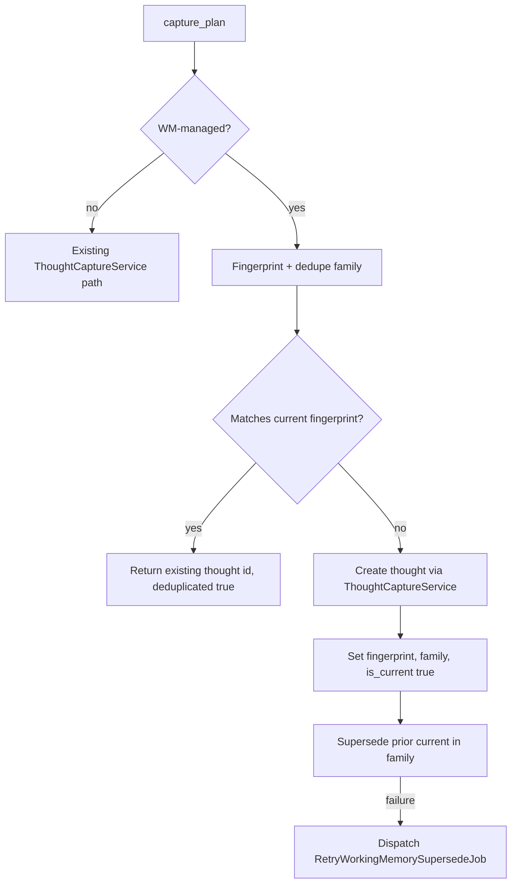

# Working Memory Deduplication and Supersede

**Date:** 2026-05-19  
**Status:** Approved  
**Plan:** [2026-05-19-working-memory-dedupe-implementation.md](../plans/2026-05-19-working-memory-dedupe-implementation.md)  
**Scope:** IdeaTub working memory ingest (MCP `capture_plan`, `upsert_working_memory`), Stream visibility, version history, scheduled cleanup  
**Related:** [2026-05-18-working-memory-hybrid-external-first-design.md](./2026-05-18-working-memory-hybrid-external-first-design.md), [2026-05-12-working-memory-parity-design.md](./2026-05-12-working-memory-parity-design.md)

## Problem

Elixirr/Codex sync publishes working memory into IdeaTub on two paths:

1. **`capture_plan`** — dated Stream snapshot thoughts (tag e.g. `plan:client-working-memory-2026-05-19`).
2. **`upsert_working_memory`** — canonical `WorkingMemoryVersion` rows (`build_type=external`).

The Elixirr sync helper hashes `current.md` locally and skips unchanged files, but automations that call MCP directly (or payloads whose only diff is a `refreshed at` timestamp line) still create duplicate Stream cards hourly with identical substance.

IdeaTub has no server-side dedupe for either surface. `thoughts.content_sha256` hashes raw content for file import only; it does not strip volatile sync metadata or group by working-memory family.

## Goals

- One **current** Stream card per working-memory **dedupe family** (e.g. Dezeen client memory).
- No new **`external`** version when normalized content is unchanged.
- **Shared fingerprint** for Stream snapshots and WM versions.
- **Supersede** prior rows when content changes (keep audit trail; hide superseded from Stream).
- **Inline dedupe** on ingest; **nightly** re-scan as safety net; **queued retry** when supersede fails.
- **Backfill** command for existing duplicates (dry-run by default).

## Non-Goals

- Replacing Elixirr `current.md` authoring or client-side hash (remains first line of defence).
- Hard-deleting thoughts or versions.
- Deduping non–working-memory `capture_plan` documents unless tagged `working-memory`.
- Changing consolidated/incremental WM build dedupe (external snapshots and upserts only).

## Decisions (brainstorming)

| Topic | Decision |
|-------|----------|
| Surfaces | Stream snapshots + `WorkingMemoryVersion` |
| Unchanged content | No new row; return existing IDs (`deduplicated: true`) |
| Changed content | Create new row; supersede prior current in family |
| Hash | Configurable; default strips volatile sync lines (`strict_content_hash` opt-in) |
| Existing data | `working-memory:dedupe` backfill + nightly job (30-day window) |
| Timing | Inline on ingest + `RetryWorkingMemorySupersedeJob` on failure |

## Architecture

### Components

| Component | Responsibility |
|-----------|----------------|
| `WorkingMemoryContentFingerprint` | Normalize markdown → SHA-256 hex fingerprint |
| `WorkingMemoryDedupeFamilyResolver` | Derive stable `dedupe_family` from tags, `plan_slug`, or WM scope |
| `WorkingMemorySnapshotDedupeService` | `capture_plan` path: compare, create, supersede Stream thoughts |
| `WorkingMemoryUpsertService` (extended) | `upsert` path: compare, create, supersede `external` versions |
| `SupersedeWorkingMemorySnapshot` | Hide thought, update metadata/tags |
| `SupersedeWorkingMemoryVersion` | Set `superseded_at` / `superseded_by_version_id` |
| `RetryWorkingMemorySupersedeJob` | Idempotent repair after failed inline supersede |
| `WorkingMemoryDedupeCommand` | Backfill fingerprints + supersede historical duplicates |
| `WorkingMemoryAssembler` (extended) | Ignore superseded versions when resolving canonical |

### Fingerprint normalization

**Class:** `App\Services\WorkingMemory\WorkingMemoryContentFingerprint`

**Options:** `{ strict: bool }` (default `false`)

**Pipeline (default):**

1. Normalize line endings to `\n`.
2. **Volatile strip** (skipped when `strict: true`) — remove whole lines matching (case-insensitive):
   - `^#+\s*Working Memory\s*$`
   - `^Last Updated:.*$`
   - `^Scope:.*$`
   - Lines whose trimmed content is only a parenthetical containing `refreshed at`
3. Strip markdown for comparison: heading `#` markers, emphasis `*`/`_`, keep link text.
4. Lowercase.
5. Collapse whitespace to single spaces.
6. Trim.

**Output:** `hash('sha256', $normalized)` → 64-char hex stored as `content_fingerprint`.

**Separation from `content_sha256`:** `thoughts.content_sha256` continues to hash raw decoded content for file import. WM dedupe uses **`content_fingerprint` only**.

**Config** (`config/working_memory.php`):

```php
'dedupe_enabled' => env('WORKING_MEMORY_DEDUPE_ENABLED', true),
'dedupe_nightly_days' => (int) env('WORKING_MEMORY_DEDUPE_NIGHTLY_DAYS', 30),
'dedupe_volatile_patterns' => [ /* regex strings, overridable */ ],
```

**MCP / REST:** optional `strict_content_hash` (boolean, default `false`) on `capture_plan` and `upsert_working_memory`.

### Dedupe family key

Stable grouping independent of date in `plan_slug`.

**Format:** `wm:{scope}:{identity}`

| Source | Key |
|--------|-----|
| Elixirr client snapshot | `wm:client:{client}` from tag `client:{slug}` or metadata |
| Elixirr project snapshot | `wm:project:{client}/{project}` |
| `upsert_working_memory` | `wm:{scope_type}:{normalized_scope_key}` |

**WM-managed capture detection** — any of:

- Tag `working-memory` in `tags` or resulting metadata tags
- `plan_slug` matches `client-working-memory*` or `project-working-memory*`
- Explicit future: `source_metadata.working_memory` flag from caller

Family stored at ingest:

- Thought: `source_metadata.working_memory.dedupe_family`
- Version: `build_diagnostics_json.dedupe_family`

## Data model

### Migration

| Table | Column | Notes |
|-------|--------|-------|
| `thoughts` | `content_fingerprint` | `char(64)` nullable; index `(user_id, content_fingerprint)` |
| `working_memory_versions` | `content_fingerprint` | `char(64)` nullable; index `(working_memory_id, content_fingerprint)` |
| `working_memory_versions` | `superseded_at` | `timestamp` nullable |
| `working_memory_versions` | `superseded_by_version_id` | UUID nullable FK → `working_memory_versions.id` |

### Thought metadata (WM snapshots)

```json
{
  "working_memory": {
    "dedupe_family": "wm:client:dezeen",
    "content_fingerprint": "<sha256 hex>",
    "is_current": true,
    "superseded_at": null,
    "superseded_by_thought_id": null
  }
}
```

### Stream visibility

Superseded snapshots:

- `is_visible_in_stream = false`
- `source_metadata.working_memory.is_current = false`
- `superseded_at`, `superseded_by_thought_id` set
- Tag `working-memory:superseded` added

`scopeVisibleInStream()` behaviour unchanged; superseded WM cards drop out of Stream, search, and WM builder thought pools.

## Ingest flows

### `capture_plan` (Stream)



**Current thought lookup:** same `user_id`, `source_metadata.working_memory.dedupe_family`, `is_current === true`, `is_visible_in_stream === true` (fallback during backfill: newest in family with `working-memory` tag).

**Response extensions:**

```json
{
  "id": "<uuid>",
  "deduplicated": false,
  "content_fingerprint": "<hex>",
  "dedupe_family": "wm:client:dezeen",
  "superseded_thought_id": "<uuid|null>"
}
```

**Chunking:** Elixirr sync should pass `no_chunking: true` for WM snapshots (one card per sync). If content is chunked, dedupe applies to the document root only; document in skill/README.

### `upsert_working_memory`

1. Fingerprint + `dedupe_family = wm:{scope_type}:{scope_key}`.
2. Load latest non-superseded `external` version for the `WorkingMemory` row.
3. **Same fingerprint:** return existing `version_id`, `deduplicated: true`; do not create a version or change `latest_version_id`.
4. **Different fingerprint:** create `external` version with `content_fingerprint`; supersede prior non-superseded `external` for that memory; set `latest_version_id` to new version.

**Response extensions:**

```json
{
  "version_id": "<uuid>",
  "deduplicated": false,
  "content_fingerprint": "<hex>",
  "dedupe_family": "wm:project:<uuid>",
  "superseded_version_id": "<uuid|null>"
}
```

Both paths use a **database transaction** for create + supersede.

### Canonical read path

`WorkingMemoryAssembler::payloadFromPersistedMemory()` authoritative query:

```php
$memory->versions()
    ->whereIn('build_type', ['consolidated', 'external'])
    ->whereNull('superseded_at')
    ->orderByDesc('created_at')
    ->first();
```

`resolveCanonicalVersion()` unchanged otherwise. Version history list may include superseded rows with a “Superseded” label (read-only).

## Backfill and nightly job

**Command:** `php artisan working-memory:dedupe {--days=30} {--dry-run} {--user=}`

1. Select WM snapshot thoughts in window (tag `working-memory` or `plan_slug` pattern).
2. Backfill missing `content_fingerprint` on thoughts and `external` versions.
3. Group by `dedupe_family`.
4. Per family, cluster by `content_fingerprint`.
5. Per cluster: keep **newest** as current; supersede others (Stream + versions).
6. Reconcile `working_memories.latest_version_id` to newest non-superseded `external` when drift detected.

**Schedule:** daily `working-memory:dedupe --days=30` (no dry-run).

**Manual:** default `--dry-run`; print families, duplicate counts, IDs to supersede.

## Async retry

**Job:** `App\Jobs\RetryWorkingMemorySupersedeJob`

- Dispatched when inline supersede throws or post-create verification finds >1 current in family.
- Payload: `user_id`, `dedupe_family`, `winner_thought_id` and/or `winner_version_id`.
- Idempotent: supersede all other currents in family except winner.

## Error handling and edge cases

| Case | Behaviour |
|------|-----------|
| `dedupe_enabled=false` | Legacy behaviour (no fingerprint, no supersede) |
| Concurrent syncs | Transaction; retry job reconciles races |
| Empty normalized body | Reject at validation (existing empty content rules) |
| `strict_content_hash=true` | Skip volatile line strip |
| Non-WM `capture_plan` | Unchanged |
| Consolidated/incremental versions | Not fingerprint-deduped |
| Email/import `content_sha256` | Unchanged |

## Testing

| Level | Cases |
|-------|--------|
| Unit | Fingerprint: volatile lines, whitespace, markdown strip, strict mode |
| Feature | Duplicate `capture_plan` → `deduplicated: true`, single visible thought |
| Feature | Changed WM content → new thought, prior `is_visible_in_stream=false` |
| Feature | Duplicate `upsert` → no new version |
| Feature | Assembler uses non-superseded external when superseded row is newer-by-date but marked superseded |
| Feature | `working-memory:dedupe --dry-run` output; live supersede counts |
| Feature | Retry job fixes double-current family |

## Documentation updates

- `docs/mcp-integration-guide.md` — `strict_content_hash`, `deduplicated` response fields.
- `resources/content/help/working-memory-corpus-sync.md` — server dedupe + nightly backstop.
- Elixirr `elixirr-sync` skill (external repo / bundled skill) — `no_chunking: true` on snapshots; server dedupe as backstop.

## Implementation plan

See [2026-05-19-working-memory-dedupe-implementation.md](../plans/2026-05-19-working-memory-dedupe-implementation.md).
