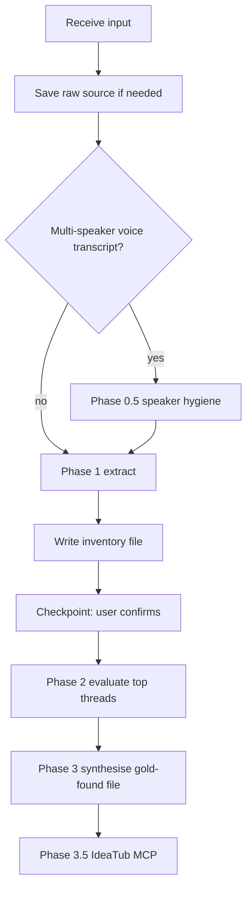

<!--
  Panning for Gold — IdeaTub adaptation (core methodology).

  Upstream source: https://github.com/NateBJones-Projects/OB1/tree/main/recipes/panning-for-gold
  Original recipe by Jared Irish (community contribution to OB1). IdeaTub replaces Open Brain
  capture with IdeaTub MCP tools; paths use docs/brainstorming/ per project spec.

  Read together with exactly one wrapper:
  - panning-for-gold-meeting.md (meetings / transcripts)
  - panning-for-gold-brain-dump.md (general dumps and exports)
-->

# Panning for Gold (core)

## Overview

Turn raw text into an evaluated, actionable inventory. Three phases: **Extract** every thread without filtering, **Evaluate** the highest-signal threads, **Synthesise** into a permanent gold-found document and IdeaTub captures.

**Core principle:** Examine every line. Nothing is dismissed as noise on the first pass. Personal, relational, wellness, financial, and creative threads matter as much as technical ones.

## When to use

- Meeting transcripts and notes (see meeting wrapper for MCP defaults).
- Voice or video transcripts, multi-speaker or single-speaker.
- Stream-of-consciousness notes and ChatGPT / Claude / Gemini exports.
- Any request to “process this”, “pan for gold”, “what did we cover”, or multi-topic markdown.

## Critical rules

1. **Persist everything to disk.** Inventory, optional per-thread evaluation notes, and gold-found must live under `docs/brainstorming/` (and subpaths below). Do not rely on chat memory alone.

2. **Summary first, transcript second.** If a summary exists beside a long transcript, extract primarily from the summary; use the transcript for exact quotes and a verification pass.

3. **Evaluations must be written to files** when using separate evaluation passes (see Phase 2). Do not depend on background tasks whose output might not return.

4. **Synthesis is inline.** You write the gold-found file after evaluation. If evaluation fragments are missing, synthesise from the inventory and your own reading.

5. **Two-pass extraction on heavy transcripts.** Pass A: summary-led extraction + targeted transcript reads. Pass B: verification scan (e.g. last portion of transcript where personal threads often appear). Merge into one inventory.

6. **One `plan_slug` per run** for IdeaTub MCP (see Phase 3.5). Reuse it across related captures.

7. **Respect MCP limits.** IdeaTub rejects `content` longer than **65535 characters** per call on several tools. If gold-found exceeds that, split into multiple `capture_plan` sections with the same `plan_slug` and explicit `section_title`s, or summarise with user consent—never fail silently.

## Process (high level)



## Phase 0: Save raw input

If the user pasted content or it only exists in chat, save it before analysis.

Suggested paths:

- `docs/brainstorming/YYYY-MM-DD-<slug>-raw.md`
- Or keep user-provided repo path if already on disk.

`<slug>`: short kebab-case label from the title or meeting name (e.g. `2026-04-29-acme-standup` → slug `acme-standup`).

## Phase 0.5: Speaker consolidation (multi-speaker transcripts only)

Auto-generated speaker labels are often wrong (environment changes can multiply labels). Before threading:

1. **Ask first:** Who was present? Anyone brief (receptionist)? Setting (office, car)?
2. **Quick audit:** Count lines per speaker label. If labels ≫ expected speakers, do not trust attribution.
3. **Anchor phrases:** Identify lines that only one participant could have said; use flow of conversation where labels are unreliable.
4. **Scene segments:** Break on location/time jumps; attribute within segments before merging.
5. **Batch corrections:** Collect uncertain attributions in one numbered list for the user once.

If fixing attribution changes meaning for many threads, re-run extraction. If the meeting is lower stakes, fix inventory in place.

## Phase 1: Extract

### Reading strategy

1. If a summary file exists: read it first and extract threads.
2. For each thread, pull **one exact quote** from the full source (search within file; avoid reading the entire transcript repeatedly).
3. Second pass: skim areas summaries often omit (often the end of calls).

### Extraction rules

1. Read every line where feasible; do not skim.
2. Do not filter by category early—label threads for organisation only.
3. Treat context and tangents as signal.
4. Keep related ideas separate when decisions would diverge (do not over-merge).

### Inventory content

For each thread:

- Short description (1–2 sentences).
- Exact quote from source.
- Category tag (technical, personal, creative, financial, relational, wellness, operational—extend as needed).
- Notes on links to other threads.

### Save and present

Write immediately to:

`docs/brainstorming/YYYY-MM-DD-<slug>-inventory.md`

Present a numbered inventory grouped by category. State thread count. Ask whether anything feels missing or wrongly merged. If the user points to gaps, target those sections only—do not re-read huge transcripts end-to-end without cause.

## Phase 2: Evaluate

### Triage

- Pick **3–5** threads for deep evaluation (ACT NOW candidates). Fewer is fine if the dump is small.
- Short verdicts only for obvious PARK/KILL items unless the user asks otherwise.

### Depth

For each selected thread, cover:

1. Strongest formulation of the idea.
2. Why it matters to the user.
3. Build vs buy / what already exists (search codebase or web when relevant).
4. Feasibility and rough effort.
5. Connections to prior work—use IdeaTub **`search_thoughts`** with concise queries where helpful.
6. Verdict: **ACT NOW**, **RESEARCH MORE**, **PARK**, or **KILL**.
7. If ACT NOW or RESEARCH MORE: up to three concrete next actions.

Prefer **inline evaluation** in the gold-found draft for small sets. For parallel notes, write to:

`docs/brainstorming/evaluations/YYYY-MM-DD-<idea-slug>.md`

Never start more than **five** parallel evaluator passes; re-triage if you exceed that.

### Evaluation template (single thread)

Use as prose structure, not rigid boilerplate:

- Idea:
- Quote / context:
- Analysis (build vs buy, feasibility, connections via `search_thoughts`):
- Verdict:
- Next actions (if applicable):

## Phase 3: Synthesise

Write the gold-found file yourself to:

`docs/brainstorming/YYYY-MM-DD-<slug>-gold-found.md`

Suggested outline:

```markdown
# Gold found: {date} — {label}

**Source:** …
**Run:** Panning for Gold (IdeaTub)
**Threads extracted:** N
**Evaluation depth:** …

---

## ACT NOW

## RESEARCH MORE

## PARK

## KILL

## Connections discovered

## Follow-ups (people / conversations)

```

Include evidence quotes under ACT NOW / RESEARCH MORE where useful.

## Phase 3.5: Capture to IdeaTub

Use the **active wrapper** (meeting vs brain-dump) for `doc_type` and tone. Common parameters:

- **`plan_slug`:** one slug for this entire run (e.g. `2026-04-29-acme-standup`). Reuse for every related MCP call so Stream groups (`meeting:<slug>` or `research:<slug>`).
- **`project`:** workspace or topic name; keep consistent across calls.
- **`file_path`:** repo-relative path to gold-found or inventory when relevant.

### Minimum recommended captures

1. **`capture_plan`** with the **full gold-found body** as `content`, matching wrapper `doc_type`, same `plan_slug`. Prefer **one call** so IdeaTub can chunk by headings—see `CLAUDE.md`. If over **65535** characters, split by heading sections with repeated `plan_slug` and ordered `section_title`s.

2. **`capture_thought`** for each distinct **ACT NOW** item (short title plus actions in body), when valuable as standalone searchable atoms.

3. **Optional:** `capture_plan` for the inventory with `section_title` such as `Inventory` (same `plan_slug`). Skip if local files are enough.

4. **Optional:** Raw meeting stored via **`capture_meeting`** or **`capture_plan`** with `doc_type: meeting` when the wrapper is meeting mode and content is not already in IdeaTub.

Inventory sync is optional; markdown on disk remains authoritative.

### MCP reminders

- Tools cannot read local paths; read files in agent context and pass `content`.
- On MCP failure: keep files; retry later with the same `plan_slug`.

## Red flags: rushing

| Thought | Reality |
|---------|---------|
| “This is just small talk” | Relationships and tone carry deals and intros |
| “Only technical threads matter” | Tech bias is the main failure mode |
| “I’ll summarise this section” | That is skimming |
| “Personal threads are irrelevant” | They often drive priorities |

## Red flags: wasting tokens

| Thought | Reality |
|---------|---------|
| “Read the whole transcript again” | Did you use summary + search first? |
| “Spin up eight evaluators” | Re-triage; cap at five |
| “Delegate synthesis to another agent” | Write gold-found yourself |
| “Re-read for one quote” | Search inside the file |

## Common mistakes

1. Filtering what seems “actionable” too early.
2. Collapsing threads that deserve separate verdicts.
3. Not saving inventory before evaluation.
4. Trusting speaker labels blindly on voice transcripts.
5. Skipping the user checkpoint after Phase 1.

---

*For the full original OB1 skill text (including extended lessons log), see the upstream repository linked at the top.*
